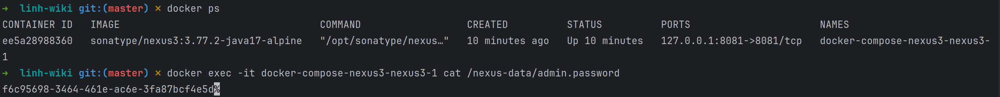

# Setup Sonatype Nexus3

## 1. Write and Running docker compose file
```yaml title="docker-compose.yml"
services:
  nexus3:
    image: sonatype/nexus3:3.77.2-java17-alpine
    ports:
      - "127.0.0.1:8081:8081"
    volumes:
      - nexus-data:/nexus-data

volumes:
  nexus-data:
    driver: local
```
Command to run docker-compose file:
```shell
docker compose up -d
```
Nexus3 running at `http://localhost:8081`

## 2. Get Admin Password to login
Command to get admin password:
```bash
docker exec -it <docker-container-name> cat /nexus-data/admin.password
```
Example:
